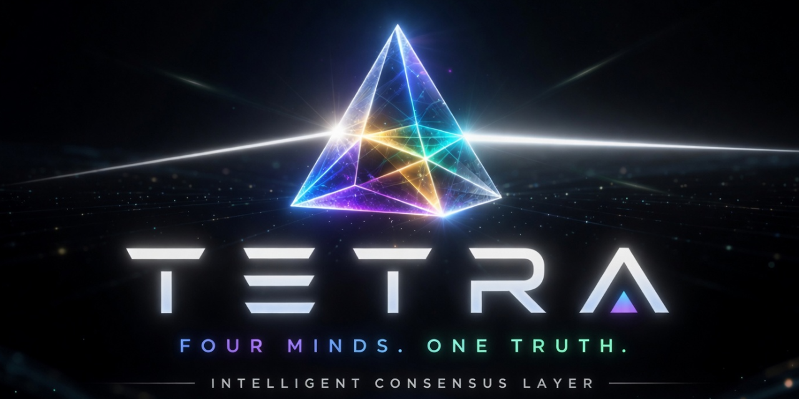

<p align="center">
  
</p>

<h1 align="center">TETRA</h1>
<p align="center"><b>Four minds. One truth.</b><br>An intelligent consensus layer that fans a question across multiple AI models, then <i>shows you</i> where they agree, where they clash, and which answer you can trust.</p>

<p align="center">
  
  
  
</p>

---

## Why TETRA

A single model can be confidently wrong. TETRA treats four frontier models as a panel — it asks them the same question, then **renders their agreement as space you can explore**. Consensus isn't a number buried in a table; it's a place you can fly through.

## Highlights

### 🔮 3D Consensus Map
Every case becomes a constellation: the four models orbit a central **consensus core**, with green threads where they agree and red where they dissent. Distance from the core encodes how contested an answer is — agreement pulls inward, conflict drifts to the shell.

### 🌌 Cohort Explorer — scales to thousands
A GPU point-cloud of an entire case cohort. Each dot is one case, colored by agreement. Unanimous decisions pack into a dense core; contested cases fan toward the models that argued them. **Orbit** it, or **Walk In** for a first-person fly-through (WASD + mouse-look).

### 🔍 Search Lens & Charts
Type a topic ("CKD", "statin") to light up its agreements or disagreements, and read the same scope as a pie / histogram — the numbers and the space update in lockstep.

### ⚔️ Sword Slice
Carve a chunk straight out of the cloud with a blade gesture, then analyze just that slice.

### ◎ Explain & Failure Analysis
Trace *why* the consensus was right, see accuracy-by-agreement, and pick any model to reveal **where and how it fails** — and whether the others outvote it.

### ∑ Statistical Engine + Reports
Welch's t-test, one-way ANOVA, Pearson/Spearman, Chi-square, Mann–Whitney, Wilcoxon — with p-values and confidence intervals, implemented from scratch. Export a short or comprehensive report.

### ⚙ Batch → Cohort Pipeline
Run a whole case set through every model in parallel, let a judge canonicalize each answer (interpretation · recommendation · medication), score the consensus against a gold standard, and export an Explorer-ready cohort — closing the loop from raw cases to full analysis.

---

## How it works

```
            ┌─────────┐   ┌──────────┐   ┌────────┐   ┌─────┐
   case  ─▶ │ OpenAI  │   │Anthropic │   │ Gemini │   │ xAI │
            └────┬────┘   └────┬─────┘   └───┬────┘   └──┬──┘
                 └──────── fan out ──────────┴───────────┘
                                 │
                          judge · canonicalize
                                 │
                     ┌───────────▼───────────┐
                     │   CONSENSUS RESPONSE   │  ← one answer you can trust,
                     └────────────────────────┘    with the disagreement made visible
```

1. **Synthesize** — merge diverse perspectives
2. **Evaluate** — compare reasoning and evidence
3. **Validate** — score accuracy and reliability
4. **Align** — find agreement, surface conflict
5. **Trust** — private, transparent, auditable

---

<p align="center"><sub>Diverse perspectives · Intelligent fusion · Trusted answers</sub></p>
